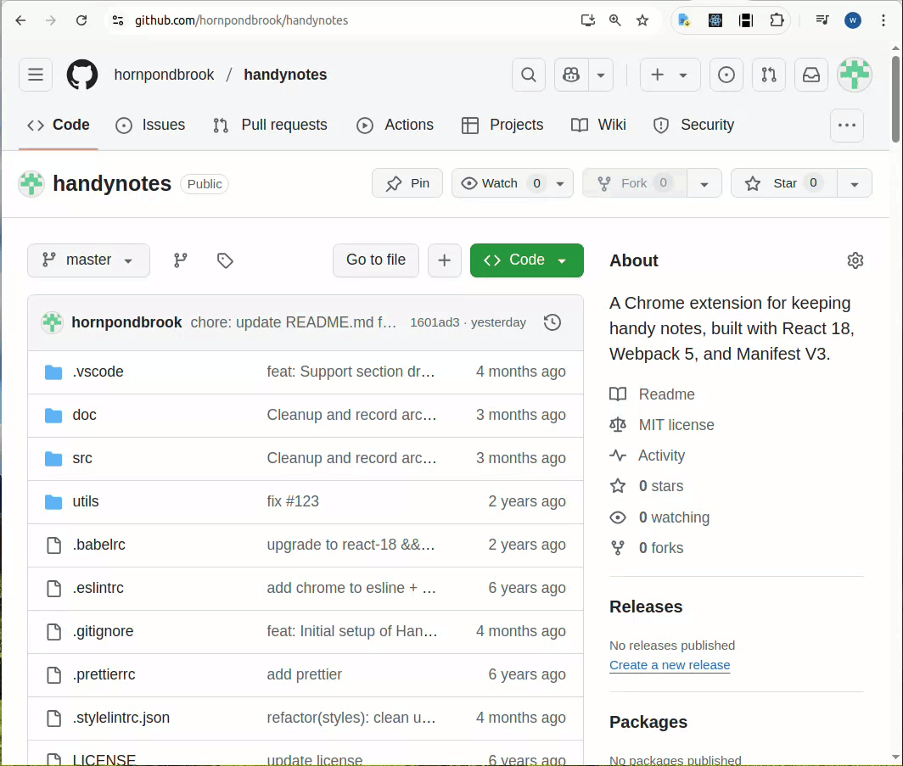

# Handy Notes React - Chrome Extension (MV3)

A Chrome extension for keeping handy notes, built with React 18, Webpack 5, and Manifest V3.

## About This Project

Handy Notes React allows you to keep track of keyboard shortcuts and anything noteworthy or memorable through a convenient side panel in your Chrome browser.

This project is built upon a robust boilerplate that includes:

- Chrome Extension Manifest V3
- React 18
- Webpack 5
- Webpack Dev Server 4
- React Refresh
- `react-refresh-webpack-plugin`
- `eslint-config-react-app`
- Prettier
- TypeScript

The original boilerplate was inspired by and adapted from [https://github.com/samuelsimoes/chrome-extension-webpack-boilerplate](https://github.com/samuelsimoes/chrome-extension-webpack-boilerplate).

## Demo



## Installing and Running

### Procedures:

1. Check if your [Node.js](https://nodejs.org/) version is >= **18**.
2. Clone this repository.
3. Optionally, update the package's `name`, `description`, and `repository` fields in `package.json` if you intend to fork or publish independently. The current project name is "Handy Notes React".
4. The extension name in `src/manifest.json` is already set to "Handy Notes React".
5. Run `npm install` to install the dependencies.
6. Run `npm start`
7. Load your extension on Chrome following:
   1. Access `chrome://extensions/`
   2. Check `Developer mode`
   3. Click on `Load unpacked extension`
   4. Select the `build` folder.
8. Happy hacking.

## Structure

All your extension's code must be placed in the `src` folder.

This extension primarily uses:
- A **Side Panel** (`sidepanel.html`): This is the main interface for your notes.
- A **Background Service Worker** (`background.bundle.js`): For handling background tasks and events.

Feel free to customize or expand upon these as needed.

## TypeScript

This boilerplate now supports TypeScript! The `Options` Page is implemented using TypeScript. Please refer to `src/pages/Options/` for example usages.

## Webpack auto-reload and HRM

To make your workflow much more efficient this boilerplate uses the [webpack server](https://webpack.github.io/docs/webpack-dev-server.html) to development (started with `npm start`) with auto reload feature that reloads the browser automatically every time that you save some file in your editor.

You can run the dev mode on other port if you want. Just specify the env var `port` like this:

```
$ PORT=6002 npm run start
```

## Content Scripts

Although this boilerplate uses the webpack dev server, it's also prepared to write all your bundles files on the disk at every code change, so you can point, on your extension manifest, to your bundles that you want to use as [content scripts](https://developer.chrome.com/extensions/content_scripts), but you need to exclude these entry points from hot reloading [(why?)](https://github.com/samuelsimoes/chrome-extension-webpack-boilerplate/issues/4#issuecomment-261788690). To do so you need to expose which entry points are content scripts on the `webpack.config.js` using the `chromeExtensionBoilerplate -> notHotReload` config. Look the example below.

Let's say that you want use the `myContentScript` entry point as content script, so on your `webpack.config.js` you will configure the entry point and exclude it from hot reloading, like this:

```js
{
  …
  entry: {
    myContentScript: "./src/js/myContentScript.js"
  },
  chromeExtensionBoilerplate: {
    notHotReload: ["myContentScript"]
  }
  …
}
```

and on your `src/manifest.json`:

```json
{
  "content_scripts": [
    {
      "matches": ["https://www.google.com/*"],
      "js": ["myContentScript.bundle.js"]
    }
  ]
}
```

## Intelligent Code Completion

Thanks to [@hudidit](https://github.com/lxieyang/chrome-extension-boilerplate-react/issues/4)'s kind suggestions, this boilerplate supports chrome-specific intelligent code completion using [@types/chrome](https://www.npmjs.com/package/@types/chrome).

## Packing

After the development of your extension run the command

```
$ NODE_ENV=production npm run build
```

Now, the content of `build` folder will be the extension ready to be submitted to the Chrome Web Store. Just take a look at the [official guide](https://developer.chrome.com/webstore/publish) to more infos about publishing.

## Secrets

If you are developing an extension that talks with some API you probably are using different keys for testing and production. Is a good practice you not commit your secret keys and expose to anyone that have access to the repository.

To this task this boilerplate import the file `./secrets.<THE-NODE_ENV>.js` on your modules through the module named as `secrets`, so you can do things like this:

_./secrets.development.js_

```js
export default { key: '123' };
```

_./src/popup.js_

```js
import secrets from 'secrets';
ApiCall({ key: secrets.key });
```

:point_right: The files with name `secrets.*.js` already are ignored on the repository.

## Resources:

- [Webpack documentation](https://webpack.js.org/concepts/)
- [Chrome Extension documentation](https://developer.chrome.com/extensions/getstarted)

---

HornPondBrook | [Project Repository](https://github.com/hornpondbrook/handynote)
